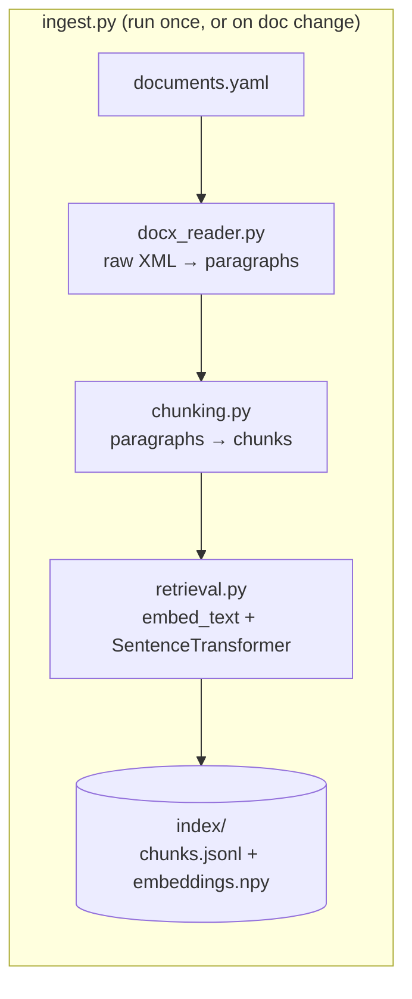
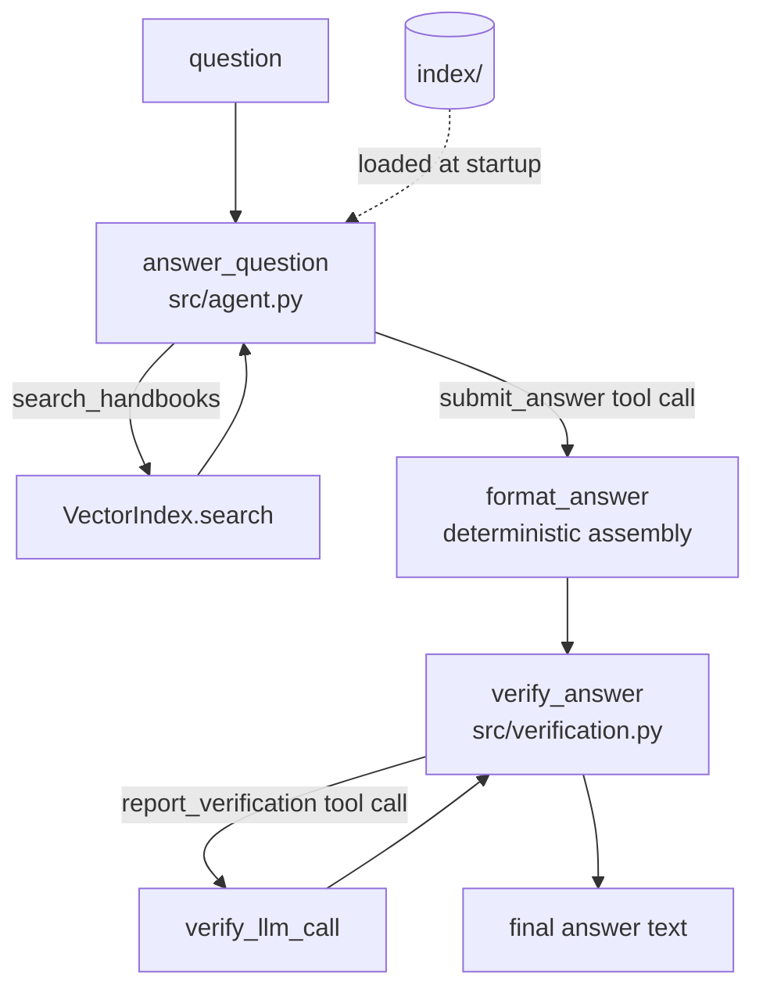

# Wisq: RAG Q&A System Design

This is the current, as-built design of the Acme HR benefits Q&A system. Doc covers what each piece does, why it's built that way, what it costs, and what to do before this needs to handle a bigger corpus or more traffic. System is a CLI that answers employee questions against three Acme HR handbook `.docx` files using retrieval-augmented generation.

Two constraints govern every decision in this doc:
- Retrieve, don't stuff. Every claim in an answer traces back to a chunk actually returned by a search call.
- Never fabricate. If the retrieved excerpts don't resolve the question, the system says unknown or hedges. It doesn't guess.

Three things make this corpus harder than generic RAG: two nearly-identical global handbook versions (2025 vs. 2026) that differ only in a few numbers, a regional handbook that overrides the global one for exactly one benefit type (PTO) and defers to it for everything else, and jurisdiction names in questions ("Asia") that are broader than what the regional handbook actually covers (China, Japan, Taiwan). If you're new to this repo: read "Life of a query" below first, then skim the component section that matches whatever you're about to touch.

## Contents

- [Repo map](#repo-map)
- [Life of a query](#life-of-a-query)
- [Architecture](#architecture)
- [Core components](#core-components)
  1. [Document ingestion — `src/docx_reader.py`](#1-document-ingestion--srcdocx_readerpy)
  2. [Chunking — `src/chunking.py`](#2-chunking--srcchunkingpy)
  3. [Embedding & retrieval — `src/retrieval.py`](#3-embedding--retrieval--srcretrievalpy)
  4. [Agent loop & structured tool contracts — `src/agent.py`](#4-agent-loop--structured-tool-contracts--srcagentpy)
  5. [Verification — `src/verification.py`](#5-verification--srcverificationpy)
  6. [Evaluation harness — `evals/` and `tests/`](#6-evaluation-harness--evals-and-tests)
- [Design principles that cut across every component](#design-principles-that-cut-across-every-component)
- [Known limitations](#known-limitations)
- [Path to scale — what to target next](#path-to-scale--what-to-target-next)
  1. [Observability](#1-observability--nothing-exists-today-needed-before-any-real-deployment)
  2. [Eval harness rigor](#2-eval-harness-rigor--replace-substring-heuristics-before-they-hide-something-real)
  3. [Vector DB migration](#3-vector-db-migration--designed-and-prototype-verified-deferred-until-the-corpus-grows)
  4. [LLM-assisted (semantic) chunking](#4-llm-assisted-semantic-chunking--same-shape-as-3)
  5. [Cost & latency at volume](#5-cost--latency-at-volume)
  6. [Service-ification and concurrency](#6-service-ification-and-concurrency)
  7. [Document lifecycle at scale](#7-document-lifecycle-at-scale)
- [Where to find more](#where-to-find-more)

## Repo map

| Path | What it is |
|---|---|
| `documents.yaml` | Declarative manifest of source documents — add/deprecate a doc here, not in code |
| `ingest.py` | Builds the index from the manifest; CLI persists to `index/` |
| `main.py` | Query CLI — no args runs 8 example queries, `--ask` runs one |
| `src/docx_reader.py` | Raw-XML `.docx` paragraph extraction |
| `src/chunking.py` | Paragraph → chunk splitting |
| `src/retrieval.py` | Embedding + `VectorIndex` (build/save/load/search) |
| `src/agent.py` | The Claude tool-use loop that turns a question into a draft answer |
| `src/verification.py` | The grounding check that turns a draft into a final answer |
| `src/models.py` | Shared dataclasses (`DocMeta`, `Paragraph`, `Chunk`, `ScoredChunk`) |
| `evals/` | Live-API acceptance suites (`eval.py`: 8 take-home queries; `edge_cases.py`: 36-case production-readiness suite) |
| `tests/` | Offline, zero-API-call unit + regression tests |
| `docs/backlog/` | Fully-investigated deferred work — root cause, fix sketch, test plan already written |
| `CLAUDE.md` | Session-continuity notes for AI agents working in this repo — orientation, correctness contract, gotchas |

Setup and day-to-day commands are in `README.md` — this doc doesn't repeat them.

## Life of a query

The fastest way to understand the system is to trace `python main.py --ask "What is the PTO
allowance for a Taiwanese employee?"` end to end:

1. `main.py` loads the prebuilt index (`VectorIndex.load("index")`) and calls
   `answer_question()`.
2. `answer_question()` (`src/agent.py:214`) calls `index.preload_model()` — starts loading the
   local embedding model on a background thread — then sends the question to Claude with two
   tools available: `search_handbooks` and `submit_answer`, and `tool_choice={"type": "any"}`
   forcing it to call one of them every turn.
3. Claude calls `search_handbooks` with a query like `"PTO entitlement Taiwan"`. `answer_question`
   calls `index.search()`, which embeds the query, filters candidates by any `doc_type`/
   `version_year` the model supplied, and returns the top `SEARCH_K` chunks by cosine
   similarity. Retrieved chunks accumulate in `cited_chunks`; formatted excerpts go back to
   Claude as a `tool_result`.
4. Claude may call `search_handbooks` again (e.g., to separately pull the precedence rules) —
   this repeats until it's ready to answer, capped at `MAX_TOOL_ITERATIONS = 8`.
5. Claude calls `submit_answer` with three fields — `verdict`, `reason`, `citation` — instead
   of writing free text. `format_answer()` (`src/agent.py:183`) deterministically assembles
   them into `"{verdict}\n\n{reason}\n\n— ({citation})"`.
6. `answer_question` calls `verify_answer(draft, cited_chunks, verify_llm_call)`
   (`src/verification.py:60`). If `cited_chunks` is empty, this hard-fails immediately with no
   LLM call. Otherwise it asks Claude — via a second tool call,
   `report_verification` — whether every claim in the draft is backed by the cited excerpts.
7. If `SUPPORTED`, the draft is returned as-is. If not, a fallback "can't confirm this"
   message is returned instead, and the original draft is preserved on
   `VerifiedAnswer.rejected_draft` for debugging.
8. `main.py` prints `result.text`.

Two full Claude round-trips minimum (search+answer, then verify) is a deliberate cost — see
"Design principles," below.

## Architecture

## Core components

### 1. Document ingestion — `src/docx_reader.py`

**Choice:** read `word/document.xml` directly via stdlib `zipfile` + `ElementTree`, not
`python-docx`.

**Why:** `python-docx`'s `Document.paragraphs` only returns top-level body paragraphs and
silently drops anything nested in a table — and the real handbooks' section headers live
inside single-cell "banner" tables, which would have dropped every header in this corpus.
Walking the raw XML directly visits every paragraph regardless of nesting, so nothing is lost.

**Tradeoff:** more code than a one-line `python-docx` call, and coupled to the OOXML schema —
accepted because silent data loss is a worse failure mode than ~20 extra lines, and the
schema is stable enough not to be fragile in practice.

### 2. Chunking — `src/chunking.py`

**Choice:** one non-empty paragraph = one chunk (`chunk_document()`), tagged with the nearest
preceding heading (recognized by paragraph style plus a length guard, since one document's
real body paragraphs share a style with its headers). Specific sections can opt into
sentence-level splitting instead, via `documents.yaml` (`DocMeta.split_sentences_in_sections`)
— today only APAC's `SCOPE` section uses it.

**Why:** the two document families use different, inconsistent heading conventions, so a
style-only rule alone misclassifies real body content as headers — the length guard fixes
that without per-document special-casing. Sentence-splitting is scoped rather than
corpus-wide because a full corpus-wide split was tried first and reverted: it nearly doubled
the chunk count and regressed an already-passing retrieval test by diluting search results
with mostly-redundant fragments elsewhere. A targeted opt-in for the one confirmed-diluted
section fixed the same underlying problem without that cost.

**Tradeoff:** a policy split across two consecutive paragraphs under one heading can still
lose part of its meaning to a different chunk, since chunking is otherwise strictly
one-paragraph-per-chunk — not yet hit beyond the one already-fixed case, but a real structural
limit of the approach worth re-checking if the corpus grows.

### 3. Embedding & retrieval — `src/retrieval.py`

**Choice:** `VectorIndex` is a list of chunks plus a plain `numpy` array of normalized
embeddings — cosine similarity via `np.dot`, no vector database (`SEARCH_K = 10`).
Disambiguation happens two ways: `embed_text()` prepends a metadata header (document,
jurisdiction, version year, section) to each chunk before embedding, and `search()` also
accepts explicit `doc_type`/`version_year` filters Claude can apply once it's resolved a year
or jurisdiction from the question.

**Why:** the 2025 and 2026 PTO paragraphs are nearly word-for-word identical except the day
count — nothing in the raw text distinguishes them, so embedding similarity alone can't
reliably tell them apart. The header and the filters are two independent ways to break that
tie. Plain `numpy` was verified rather than assumed sufficient: a Chroma + hybrid-search
prototype run against the real corpus and a 10-query adversarial battery found no case the
simpler system missed.

**Tradeoff:** `version_year=None` on a chunk has to mean "matches any year filter" rather than
"only when unfiltered," since APAC's regional handbook is evergreen — an easy footgun that
would otherwise silently drop regional content from year-scoped queries. And plain `numpy`
won't hold indefinitely; a vector-DB migration is fully designed and ready to implement once
the corpus outgrows a linear scan (`docs/backlog/2026-08-20-vector-db-migration-for-scale.md`).

The embedding model also loads on a background thread (`preload_model()`) so its ~6s one-time
cost overlaps with the first Claude round-trip instead of blocking after it — a free latency
win with no behavior tradeoff. A related attempt to also batch multiple search calls into one
turn was reverted after it destabilized `verify_answer` on absence-based questions; not worth
a correctness risk for an unconfirmed latency gain.

### 4. Agent loop & structured tool contracts — `src/agent.py`

**Choice:** `answer_question()` drives a multi-hop Claude tool-use loop
(`claude-sonnet-5`, no `temperature` — this model rejects non-default sampling params) with
two tools, both forced via `tool_choice={"type": "any"}` so Claude can never end a turn
without calling one: `search_handbooks` (free-text query + optional `doc_type`/`version_year`
filters) and `submit_answer` (three fields — `verdict`/`reason`/`citation` — called once when
ready to answer). The verifier (component 5) uses the same tool-schema pattern for its own
classification.

**Why:** free chat text proved unreliable under live sampling — the same compound question
came back one run as a bulleted list with intro/outro framing, another as flowing prose with
the citation jammed onto the reason sentence, despite explicit prompt instructions; a
free-text verifier separately once reasoned past its own leading SUPPORTED/UNSUPPORTED token,
breaking a naive prefix check. A tool schema makes the shape a code guarantee instead of a
prompt request — `format_answer()` deterministically assembles the three submitted fields —
and made the layout itself unit-testable offline with zero API calls, which a prompt
instruction never could be.

**Tradeoff:** more moving parts (three tool schemas instead of free text), and this only
closes formatting/classification failures — it doesn't make the model's underlying reasoning
more correct, just more reliably shaped once it's decided what to say.

Two smaller rules round out the loop: `MAX_TOOL_ITERATIONS = 8` caps the search loop above the
highest round count observed live for a legitimately thorough question, so it only trips on
genuine non-convergence; and the `reason` field is explicitly forbidden from revealing what
the answer would be under each possible resolution of a hedge (including citing both
candidates' numbers as "background," which live testing showed the model would otherwise do
to let the reader compute the withheld answer) — this needed two rounds of live strengthening
before holding reliably, and likely retains some residual sampling variance since it's an
instruction, not a schema constraint.

### 5. Verification — `src/verification.py`

**Choice:** `verify_answer()` is a second, independent LLM pass — given the draft and only the
chunks actually cited, ask whether every claim is directly supported. Two deterministic
checks run first with no LLM call: `grounded=False` if no excerpts were cited at all, or if
the draft's citation doesn't name any retrieved document. The verifier prompt also explicitly
credits three inference patterns as valid rather than "unresolved conflicts" — a specific rule
carving itself out of a general fallback, a general default with no specific override, and a
closed enumerated list with an explicit "everyone else, refer elsewhere" instruction.

**Why:** this pass is the system's actual anti-hallucination enforcement, not just the system
prompt's instructions — the prompt has leaked pretrained knowledge before (a draft once named
countries that appear nowhere in the corpus), and this pass caught and rejected it before the
user saw it. The three credited patterns exist because the verifier initially under-credited
all of them, intermittently rejecting correct drafts that were valid logical consequences of
the excerpts rather than direct restatements of them.

**Tradeoff:** a full second API round-trip per question — real latency and cost, accepted as
the price of the "never fabricate" requirement. Each credited pattern also needed adversarial
testing (inverted-direction and fabricated-number controls) before shipping, since crediting
more inference patterns risks making the verifier too lenient toward genuinely wrong drafts —
and even so, one pattern has since resurfaced live and remains only analytically (not freshly)
reproduced (`docs/backlog/2026-08-22-verify-answer-carve-out-overgeneralization-false-rejection.md`).

### 6. Evaluation harness — `evals/` and `tests/`

**Choice:** two different kinds of correctness check, kept separate. `tests/` is offline,
zero API calls, real local embeddings — the regression guard for chunking/retrieval/matching
changes. `evals/` is live-API: `eval.py` runs the 8 take-home queries on every meaningful
change; `edge_cases.py` is a 36-case production-readiness suite run on demand given its real
API cost (~36 questions × 3-5 Claude calls each).

**Why:** offline tests are cheap enough to run constantly and catch retrieval/logic
regressions instantly; live evals are the only way to catch LLM sampling-variance bugs, but
cost real time and money, so they're reserved for meaningful changes rather than every commit.

**Tradeoff:** `evals/matching.py`'s matcher (`matches()`) is a substring/keyword heuristic on
free-form model output, not a semantic check — it's caught real bugs (numeric markers matching
inside a larger number; a rejected answer "passing" by accidental substring coincidence, both
since fixed) but remains gameable by phrasing. Treat a green eval run as a smoke test, not a
strict regression gate.

## Design principles that cut across every component

These aren't componentized — they're decisions that shaped multiple pieces of the system and
should shape whatever gets built next in it.

- **Guarantee structurally, not by prompt request, whenever downstream code depends on a
  specific output shape.** The `submit_answer`/`format_answer` and `report_verification`/enum
  fixes are the clearest examples: two separate real bugs, same root cause (parsing free
  text), same fix pattern (tool schema constrains the shape; code assembles the final string).
  Apply this reflexively the next time an LLM's output needs to be reliably parseable —
  don't write a prompt instruction and hope.
- **Fail closed, not open, on grounding.** Empty `cited_chunks` → hard rejection, no LLM call.
  An unsupported verdict → a "can't confirm" fallback, never the ungrounded draft. The system
  would rather under-answer than fabricate.
- **Prefer the narrowest fix that's confirmed to work over a more general one that "should"
  work.** The chunking section above is the clearest example — a corpus-wide sentence-split
  regressed a passing test; a manifest-scoped one-section fix didn't. This shows up again in
  the vector-DB and LLM-chunking decisions: both were prototyped against the real corpus
  before being deferred, not assumed unnecessary.
- **Config over code branching.** `documents.yaml` governs which documents are active and
  which sections get sentence-split; adding, deprecating, or exempting a document is a
  manifest edit, not a code change.
- **Every non-trivial prompt or logic change gets a live-verification pass before landing**,
  not just an offline test pass — offline tests can't catch LLM sampling variance, and this
  codebase has repeatedly found real bugs (verdict ordering, verifier false-rejections, the
  formatting bugs above) that only a live rerun surfaces. Multiple reps, not one — single live
  runs have been misleading more than once in this project's history (see
  `docs/TRANSCRIPT.md` for the full record).

## Known limitations

Organized by what kind of risk they carry, not by when they were found (`docs/TRANSCRIPT.md`
has the full chronological narrative, and `docs/HISTORY.md` a short index into it, if you want
that instead).

**Correctness / reliability**

- A policy split across two consecutive paragraphs under one heading can still lose its
  second half — chunking is strictly one-paragraph-per-chunk, and the fix for the one
  confirmed case (`SCOPE`) was a `SEARCH_K` widen, not a structural fix for the general shape.
  A systematic grep of the corpus for similar scope/exception language found no second
  instance — every other candidate ranks comfortably inside `SEARCH_K`. Confirmed absent
  today, not proven absent forever — re-check the same way if the corpus grows.
- Live draft-time named-entity hallucination (inventing plausible-sounding but never-retrieved
  entity names) was found and given a restrictive system-prompt fix, but only 7 live
  reproductions back it — too small a sample to prove the fix against a rare event. See
  `docs/backlog/2026-08-20-draft-time-named-entity-hallucination.md`.
- `verify_answer` can over-generalize a sibling benefit's specific carve-out into false
  suspicion of a *different* benefit that the same excerpt explicitly routes to the general
  rule (e.g. treating the APAC gym rate as if it needed PTO-style regional precedence, when
  the excerpt explicitly says "for all other benefits, refer to" the global rule). Root cause
  confirmed analytically (the original rejections self-describe the over-generalization in
  their own reasoning text), but 44 live reps across two reproduction methodologies couldn't
  re-trigger the specific pattern fresh — no clean before/after baseline exists to test a fix
  against, so one is deliberately not shipped yet. See
  `docs/backlog/2026-08-22-verify-answer-carve-out-overgeneralization-false-rejection.md`'s
  "Root cause investigation" section for the full account.

**Test/eval harness gaps**

- The word markers in `evals/matching.py` (`"unknown"`, `"which country"`, etc.) are
  substring/keyword matching on free-form text, not semantic — gameable by construction,
  already needed reactive patching as real phrasing varied.
- `VerifiedAnswer.rejected_draft` is written on every downgrade but never read by any caller —
  useful groundwork for a future `--debug` flag, currently dead weight.

## Path to scale — what to target next

Ranked by what would break first if this stopped being a take-home and started being a real
service, not by how long each has been on the backlog.

### 1. Observability — nothing exists today, needed before any real deployment

There is currently no logging of retrieval scores, tool-call sequences, `verify_answer`
accept/reject rates, or latency/cost per question. This is the single biggest gap between
"works when I run it live and read the output" and "operable as a service." Before anything
else on this list: structured logging of each stage (search queries + top-k scores, submitted
verdict/reason/citation, verify accept/reject + reason), and a way to sample real production
answers for grounding-accuracy review the same way this project's live-verification passes
have been done manually all along. Trigger: before onboarding any real user traffic, not
after.

### 2. Eval harness rigor — replace substring heuristics before they hide something real

`evals/matching.py` has now caused or hidden real bugs twice: the numeric-boundary
false-positive fix, and a `grounded`-blind-spot (numeric/hedge markers could "pass" against a
rejected, ungrounded answer if the expected marker happened to appear in the dumped rejection
text) — both since fixed. At the current scale this is a tolerable smoke test; it stops being
tolerable as soon as more people are adding questions to `edge_cases.py` and trusting a green
run without reading the output. Remaining: evaluate replacing keyword matching with an
LLM-judge comparison against a gold answer for at least the harder cases. Trigger: before
growing `edge_cases.py` much further, or before any CI gate depends on it.

### 3. Vector DB migration — designed and prototype-verified, deferred until the corpus grows

`docs/backlog/2026-08-20-vector-db-migration-for-scale.md` has the full schema, indexing,
filtering, and document-lifecycle design, verified against a live Chroma + hybrid-search
prototype that found no accuracy or performance win at the current ~73-chunk size. This is the
right item to pick up first once the corpus meaningfully grows — not before, since the
prototype found nothing to gain yet. Trigger: corpus size, not calendar time.

### 4. LLM-assisted (semantic) chunking — same shape as #3

`docs/backlog/2026-08-20-llm-assisted-semantic-chunking.md`: two prototypes confirmed real
differentiating value (sub-sentence exception splitting, cross-paragraph merging) that plain
syntactic rules can't do, but neither was needed to fix any gap found in this specific
3-document corpus. Trigger: a new document whose structure the current paragraph/heading
rules can't safely assume — not before.

### 5. Cost & latency at volume

Two full Claude round-trips per question (multi-hop answer + separate verification) is a
deliberate grounding trade-off today, acceptable at take-home query volume. At real traffic
volume, revisit: prompt caching (investigated and shelved — `SYSTEM_PROMPT` + `SEARCH_TOOL`
together clears Sonnet 5's 1024-token cache minimum, but 97% of per-question time is Claude
generation, not input reprocessing, so caching saves cost, not the latency that motivated
investigating it — worth a second look once call volume is high enough that the cost savings
alone justify it), and whether `verify_answer`'s max_tokens=1000/thinking-disabled call can be
made cheaper without weakening the check it exists to run.

### 6. Service-ification and concurrency

`main.py` is a synchronous CLI processing one question at a time; `VectorIndex` is loaded
fresh per process. A real service needs: a long-lived process serving concurrent requests
against one loaded index, request-level timeout/retry/backoff (none exists today — an API
error or rate limit currently just propagates as an exception), and a decision on whether
`answer_question`'s per-request Claude client needs connection pooling or per-request
instantiation is fine at expected volume.

### 7. Document lifecycle at scale

`documents.yaml` today is hand-edited by whoever adds or deprecates a document, then
`ingest.py` is re-run manually. Fine for three documents. Growing to many more handbooks,
across more regions, likely needs: validation that a new manifest entry's declared
`jurisdictions`/`version_year` don't silently conflict with an existing active document,
and a decision on whether re-ingestion should be triggered by a document-management upload
rather than a manual CLI run.

## Where to find more

- **`CLAUDE.md`** — session-continuity notes for AI agents working in this repo: orientation,
  the correctness contract, operating rules, and gotchas. Not a decision log — see below.
- **`docs/TRANSCRIPT.md`** — the full decision-by-decision narrative, in the exact order each
  decision was made, with the live evidence gathered before each one shipped, including dead
  ends that were tried and reverted. **`docs/HISTORY.md`** is a short, section-linked index
  into it — start there to find the section you need.
- **`docs/backlog/`** — every deferred item referenced above, fully investigated: root cause,
  suggested fix, risk, and test plan already written, not a one-line TODO.
- **`docs/superpowers/specs/2026-08-19-rag-qa-system-design.md`** — the original
  pre-implementation proposal. **Superseded by this document** for how the system actually
  works today; kept for historical context on what was planned before any of the live fixes
  in this doc happened.
