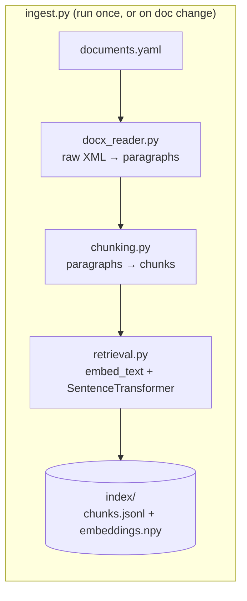
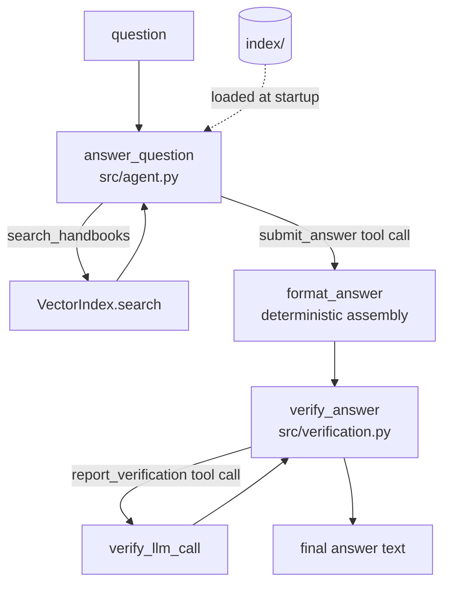

# Wisq: RAG Q&A System Design

This is the current, as-built design of the Acme HR benefits Q&A system: what each piece
does, why it's built that way, what it costs, and what to do before this needs to handle a
bigger corpus or more traffic. It supersedes `docs/superpowers/specs/2026-08-19-rag-qa-system-design.md`
(the pre-implementation proposal) as the reference for how the system actually works today —
that file is still useful as a historical record of the original plan.

If you're new to this repo: read "Life of a query" below first, then skim the component
section that matches whatever you're about to touch.

## System summary

A CLI that answers employee questions against three Acme HR handbook `.docx` files, using
retrieval-augmented generation instead of stuffing full documents into the prompt. Two hard
constraints shape almost every design decision in this doc:

- **Retrieve, don't stuff.** Every claim in an answer must trace back to a chunk that was
  actually retrieved by a search call, never to a document pasted wholesale into context.
- **Never fabricate.** If retrieved excerpts don't resolve the question, the system must say
  `unknown` or hedge — not produce a fluent, plausible-sounding guess.

Three things make this corpus harder than generic RAG: two nearly-identical global handbook
versions (2025 vs. 2026) that differ only in a few numbers, a regional handbook that overrides
the global one for exactly one benefit type (PTO) and defers to it for everything else, and
jurisdiction names in questions ("Asia") that are broader than what the regional handbook
actually covers (China, Japan, Taiwan).

## Repo map

| Path | What it is |
|---|---|
| `documents.yaml` | Declarative manifest of source documents — add/deprecate a doc here, not in code |
| `ingest.py` | Builds the index from the manifest; CLI persists to `index/` |
| `main.py` | Query CLI — no args runs 8 example queries, `--ask` runs one |
| `src/docx_reader.py` | Raw-XML `.docx` paragraph extraction |
| `src/chunking.py` | Paragraph → chunk splitting |
| `src/retrieval.py` | Embedding + `VectorIndex` (build/save/load/search) |
| `src/agent.py` | The Claude tool-use loop that turns a question into a draft answer |
| `src/verification.py` | The grounding check that turns a draft into a final answer |
| `src/models.py` | Shared dataclasses (`DocMeta`, `Paragraph`, `Chunk`, `ScoredChunk`) |
| `evals/` | Live-API acceptance suites (`eval.py`: 8 take-home queries; `edge_cases.py`: 36-case production-readiness suite) |
| `tests/` | Offline, zero-API-call unit + regression tests |
| `docs/backlog/` | Fully-investigated deferred work — root cause, fix sketch, test plan already written |
| `CLAUDE.md` | Session-continuity notes for AI agents working in this repo — orientation, correctness contract, gotchas |

Setup and day-to-day commands are in `README.md` — this doc doesn't repeat them.

## Life of a query

The fastest way to understand the system is to trace `python main.py --ask "What is the PTO
allowance for a Taiwanese employee?"` end to end:

1. `main.py` loads the prebuilt index (`VectorIndex.load("index")`) and calls
   `answer_question()`.
2. `answer_question()` (`src/agent.py:214`) calls `index.preload_model()` — starts loading the
   local embedding model on a background thread — then sends the question to Claude with two
   tools available: `search_handbooks` and `submit_answer`, and `tool_choice={"type": "any"}`
   forcing it to call one of them every turn.
3. Claude calls `search_handbooks` with a query like `"PTO entitlement Taiwan"`. `answer_question`
   calls `index.search()`, which embeds the query, filters candidates by any `doc_type`/
   `version_year` the model supplied, and returns the top `SEARCH_K` chunks by cosine
   similarity. Retrieved chunks accumulate in `cited_chunks`; formatted excerpts go back to
   Claude as a `tool_result`.
4. Claude may call `search_handbooks` again (e.g., to separately pull the precedence rules) —
   this repeats until it's ready to answer, capped at `MAX_TOOL_ITERATIONS = 8`.
5. Claude calls `submit_answer` with three fields — `verdict`, `reason`, `citation` — instead
   of writing free text. `format_answer()` (`src/agent.py:183`) deterministically assembles
   them into `"{verdict}\n\n{reason}\n\n— ({citation})"`.
6. `answer_question` calls `verify_answer(draft, cited_chunks, verify_llm_call)`
   (`src/verification.py:60`). If `cited_chunks` is empty, this hard-fails immediately with no
   LLM call. Otherwise it asks Claude — via a second tool call,
   `report_verification` — whether every claim in the draft is backed by the cited excerpts.
7. If `SUPPORTED`, the draft is returned as-is. If not, a fallback "can't confirm this"
   message is returned instead, and the original draft is preserved on
   `VerifiedAnswer.rejected_draft` for debugging.
8. `main.py` prints `result.text`.

Two full Claude round-trips minimum (search+answer, then verify) is a deliberate cost — see
"Design principles," below.

## Architecture

## Core components

### 1. Document ingestion — `src/docx_reader.py`

Reads `word/document.xml` directly via stdlib `zipfile` + `ElementTree`, not `python-docx`.

**Why:** the real handbooks' section headers live inside single-cell "banner" tables.
`python-docx`'s `Document.paragraphs` only returns top-level body paragraphs and silently
drops anything nested in a table — which would have dropped every section header in this
corpus. Walking the raw XML tree with `.iter()` visits every `w:p` in document order
regardless of table nesting, so nothing is silently lost. This was found empirically, not
anticipated — it cost the corpus's headers on the first pass before the fix.

**Tradeoff accepted:** more code than `pip install python-docx; doc.paragraphs`, and it's
coupled to the OOXML schema. Justified here because the silent-data-loss failure mode is
worse than the extra ~20 lines, and `.docx`'s XML schema is stable enough that this isn't
fragile in practice.

### 2. Chunking — `src/chunking.py`

One non-empty paragraph = one chunk (`chunk_document()`, `src/chunking.py:17`), tagged with
the nearest preceding heading. Headings are recognized by paragraph style
(`HEADING_STYLES = {"Compact", "Heading2"}`) plus a `MAX_HEADING_LENGTH = 60` length guard.

**Why paragraph-level, not header-regex splitting:** the two global handbooks use
`pStyle="Compact"` for real headers; the APAC handbook uses `pStyle="Heading2"` — no shared
convention to regex against. Worse, APAC's "LOCAL LAW PROVISIONS" section has five real body
paragraphs that *also* use `Compact` — a naive style-only rule misclassified them as headings
and silently dropped them. The length guard fixes this without per-document special-casing.

**Why not sentence-level splitting everywhere:** tried once, reverted. A live nondeterminism
report traced to APAC's `SCOPE` section merging its coverage statement with its exclusion
clause into one chunk, diluting the exclusion clause's embedding enough to rank #19-21 of 71
chunks for out-of-APAC queries. Splitting *every* paragraph in the corpus into sentences
nearly doubled the chunk count (71→136) and — the actual reason it was reverted — regressed
an already-passing retrieval test, because more fragments were now competing for a fixed
`SEARCH_K` everywhere, not just where the real gap was.

**What shipped instead:** `DocMeta.split_sentences_in_sections` (`src/models.py:17`), set
per-document in `documents.yaml`, opts *specific named sections* into sentence-level
splitting. Today only APAC's `SCOPE` section uses it. `chunk_document()` raises `ValueError`
if a configured section name was never seen as an actual heading — a typo here previously
degraded chunking silently, which is the worst failure mode for a setting that exists
specifically to fix a retrieval bug.

**The general lesson, worth carrying forward:** a corpus-wide mechanical fix that "sounds
more correct" can regress a narrower, already-working case. Prefer the smallest change that
fixes the confirmed problem, verified against the existing test suite, over a more general
rule applied everywhere on the theory that it should also help.

### 3. Embedding & retrieval — `src/retrieval.py`

`VectorIndex` (`src/retrieval.py:38`) is a list of chunks plus a plain `numpy` array of
normalized embeddings — cosine similarity via `np.dot`, no vector database. `SEARCH_K = 10`.

**Contextual embedding headers.** `embed_text()` (`src/retrieval.py:21`) doesn't embed a
chunk's raw text — it prepends a metadata header (document name, `doc_type`, jurisdictions,
`version_year`, section) before embedding. The 2025 and 2026 PTO paragraphs are nearly
word-for-word identical except the day count; nothing in the raw text says which version it
belongs to, so similarity alone can't disambiguate. The header makes the vector itself
version/jurisdiction-aware. Queries are embedded raw — only the chunk side gets this
treatment.

**Structured filters as a second disambiguation layer.** `search()` also accepts explicit
`doc_type`/`version_year` filters (`src/retrieval.py:70`), which `search_handbooks`
(`src/agent.py:103`) exposes to Claude. Once Claude has resolved a year or jurisdiction from
the question, it can narrow structurally instead of hoping embedding similarity alone gets it
right. One sharp edge here: `version_year=None` on a chunk means "matches any year filter,"
not "matches only when no filter is given" — the APAC handbook is evergreen (no yearly
editions), so a query naming both a region and a year needed this to avoid silently excluding
the regional precedence clause from a year-filtered search. Get this backwards and a
year-filtered query for a regional jurisdiction returns zero regional chunks.

**Why plain `numpy`, not a vector DB — verified, not assumed.** A full Chroma + hybrid-search
(dense + BM25, fused via reciprocal rank fusion) prototype was built against the real 73-chunk
corpus and run against a 10-query battery deliberately including adversarial cases (a
paraphrase-only query sharing zero keywords with its source text). Result: `numpy` matched
Chroma-dense and Chroma-hybrid on all 10 — no case where the simpler system missed and hybrid
caught it, at this corpus's current size. The migration is fully designed and ready to
implement without re-investigation (`docs/backlog/2026-08-20-vector-db-migration-for-scale.md`)
— deferred because it currently buys nothing, not because it wasn't evaluated.

**Latency:** `preload_model()` (`src/retrieval.py:52`) starts the `SentenceTransformer` load
on a background thread from the top of `answer_question`, so the ~6s one-time cost (import +
instantiation) overlaps with the first Claude round-trip instead of blocking after it. A
system-prompt nudge to batch multiple `search_handbooks` calls into one turn was also tried as
a latency fix and reverted — a live ablation (0/4 failures reverted vs. 2/4 with it in place,
same query repeated) showed it destabilized `verify_answer` on absence-based inference
questions, likely because batching made the model treat one round of searches as a stopping
signal. Not worth trading correctness for an unconfirmed latency win.

### 4. Agent loop & structured tool contracts — `src/agent.py`

`answer_question()` (`src/agent.py:214`) drives a multi-hop Claude tool-use loop:
`claude-sonnet-5`, no `temperature` param anywhere (this model rejects non-default sampling
params — a 400 error, found live), main loop leaves adaptive thinking on
(`max_tokens=8000`).

Two tools govern the loop, both forced via `tool_choice`:

- **`search_handbooks`** (`src/agent.py:103`) — free-text query plus optional `doc_type`/
  `version_year` filters.
- **`submit_answer`** (`src/agent.py:127`) — three fields, `verdict`/`reason`/`citation`,
  called exactly once when Claude is ready to answer.

`tool_choice={"type": "any"}` forces a tool call on every turn — Claude can never end a turn
by just writing chat text, so it either searches again or submits.

**The formatting problem this solves.** Earlier, the final answer was free chat text that the
system prompt asked to follow a three-part verdict/reason/citation shape. Live testing showed
this held inconsistently: the same compound question ("sick days? 401k? insurance?") came
back one run as a bulleted list with bold labels and intro/outro framing, another run as
flowing prose with the citation jammed directly onto the reason sentence. A prompt instruction
can't *guarantee* layout the model has no structural boundary to hang it on. `submit_answer` +
`format_answer()` (`src/agent.py:183`) fixed this by moving formatting out of the model
entirely — the model supplies content via three separate fields; code assembles
`f"{verdict}\n\n{reason}\n\n— ({citation})"` deterministically, every time. This also made the
layout itself unit-testable offline with zero API calls, which a free-text prompt instruction
never could be.

**`verify_llm_call()`** (`src/agent.py:190`) uses the same pattern for the verifier: a
`report_verification` tool (`VERIFY_TOOL`, `src/agent.py:154`) with `verdict` constrained to
`enum: ["SUPPORTED", "UNSUPPORTED"]`. This replaced a free-text verifier response that
`verify_answer` parsed with `.startswith("SUPPORTED")` — which broke once, live, when the
verifier reasoned through a borderline case out loud and only reached "SUPPORTED" at the very
end of a much longer response instead of leading with it, tripping the prefix check into
discarding a correctly-grounded draft.

**The recurring principle in both fixes:** when a downstream check depends on the model's
output having a specific shape, don't ask for that shape in a prompt and hope — constrain it
with a tool schema so it's a code guarantee. This has now paid off twice in this codebase and
is the first thing to reach for the next time an LLM output needs to be reliably parseable.

**Cost control:** `MAX_TOOL_ITERATIONS = 8` (`src/agent.py:17`) caps the search loop — set
above the highest round count observed live for a legitimately thorough question (5), so it
only trips on genuine non-convergence, not a real multi-hop question.

**A hedge must not undercut itself by revealing what it's hiding.** The `reason` field's
instructions explicitly forbid stating what the answer would be under each possible
resolution — including naming each candidate policy's own number as "just supporting detail"
for the rule, which live testing showed the model would otherwise do (e.g. "the regional rate
is $30, the global rate is $50, so the more generous one applies — either way you get $50"),
letting the reader compute the withheld answer themselves. Needed a second round of live
strengthening (targeting that exact "cite both numbers as background" pattern) before it held
reliably across a 6-rep live sample — same "residual sampling variance" shape as the
verdict-ordering fix, not a rule gap that more wording alone fully eliminates.

### 5. Verification — `src/verification.py`

`verify_answer()` (`src/verification.py:60`) is a second, independent LLM pass: given the
draft and only the chunks that were actually cited, ask whether every claim is directly
supported. Two deterministic, zero-LLM-call hard-fails run before that pass: `grounded=False`
if `cited_chunks` is empty (no excerpts retrieved means no possible grounding), and
`grounded=False` if the draft's citation doesn't name any of the retrieved documents by
`display_name` — a fabricated or mismatched citation is knowable without a model call, the
same way an empty `cited_chunks` list is. Case sensitivity on the LLM verdict itself
(`SUPPORTED`/`UNSUPPORTED`) is handled defensively (`.upper().startswith(...)`) even though
`VERIFY_TOOL`'s enum already guarantees exact case today — `verify_answer()` is a
general-purpose function any `llm_call` implementation can drive, not just the tool-based one.

**Why a separate pass instead of trusting the draft:** this is the system's actual
anti-hallucination enforcement, not just the system prompt's instructions. The prompt can (and
does) leak pretrained knowledge occasionally — one live incident had a draft claim the APAC
handbook covered "Hong Kong/Singapore," which appears nowhere in the corpus (the real scope is
China, Japan, Taiwan). `verify_answer` caught and rejected it before it reached the user. This
is the load-bearing safety net; the system prompt's grounding instructions are the first line
of defense, not the only one.

**The verifier needs to credit valid inference, not just direct restatement.** Three
false-rejection patterns have been found and fixed, each a case where the correct answer is a
valid logical consequence of the excerpts rather than a direct restatement of them — the
verifier initially under-credited all three, intermittently rejecting correct drafts:
(a) a specific rule that carves itself out of a general fallback ("for X specifically, rule A;
for all other cases, rule B"), (b) a general default rule with no specific override ("applies
to all cases... unless a specific provision states otherwise"), and (c) a closed, enumerated
list of covered cases plus an explicit "everyone else, refer elsewhere" instruction (e.g. the
APAC handbook naming exactly three covered countries) — found after a live report showed the
verifier's own rejection text stating the fact that proves non-coverage ("only China, Japan,
and Taiwan are covered") and then declining to draw the one-step conclusion, because that
excerpt's wording didn't pattern-match (a) or (b)'s trigger phrasing despite being at least as
strong evidence. All three are one shared addition to `build_verification_prompt()`,
adversarially tested before shipping (18 live reps across 6 cases for (a)/(b); 6 correct-draft
+ 9 adversarial-control reps for (c)) to make sure the added leniency didn't also let
genuinely unsupported drafts through. Root-caused with live instrumentation (logging every
`search_handbooks` call across 8 reproductions) before assuming the fix, not just re-tuning
the prompt on the third recurrence — see `docs/backlog/2026-08-20-verify-answer-absence-
inference-false-rejection.md`'s "Second fix implemented" section for the full diagnosis.

**Cost tradeoff, made deliberately:** this is a second full API round-trip per question, on
top of the (possibly multi-hop) answer generation. That's an intentional grounding trade,
directly required by the "never fabricate" constraint — see "Design principles," below.

### 6. Evaluation harness — `evals/` and `tests/`

Two different kinds of correctness check, deliberately kept separate:

- **`tests/`** — offline, zero API calls, real local embeddings, no mocks.
  `test_retrieval_recall.py` and `test_retrieval_entity_resolution.py` are the regression
  guard for chunking/embedding/`k` changes, run against the take-home's real queries and
  lexically-varied paraphrases of them. `test_matching.py` tests the eval harness's own
  matching logic — the one place in this suite that gets zero-cost regression coverage of the
  *test harness's own correctness*, not just the system under test.
- **`evals/`** — live-API acceptance scripts. `eval.py` is the 8 take-home queries, fast/cheap
  enough to run on every meaningful change. `edge_cases.py` is a 36-case production-readiness
  suite (entity resolution, negative space, grounding, consistency, precedence
  generalization) — run on demand, not on every commit, because of its real API cost
  (~36 questions × 3-5 Claude calls each).

**`evals/matching.py`'s `matches()` is a known-weak link** — substring/keyword heuristics on
free-form model output, not a semantic check. It's caught real bugs and been fixed reactively
more than once: numeric/currency markers now require a digit/comma boundary (so `"50"` can't
match inside `"$500"`) *and* `grounded=True` (so a rejected, ungrounded answer can't "pass" an
eval just because the expected marker happens to appear inside the dumped rejection text by
coincidence — confirmed live as a real, not theoretical, failure mode). The word markers
(`"unknown"`, `"which country"`, etc.) are still substring/keyword matching, still gameable by
construction (see "Known limitations"). Treat it as a smoke test, not a strict regression gate.

## Design principles that cut across every component

These aren't componentized — they're decisions that shaped multiple pieces of the system and
should shape whatever gets built next in it.

- **Guarantee structurally, not by prompt request, whenever downstream code depends on a
  specific output shape.** The `submit_answer`/`format_answer` and `report_verification`/enum
  fixes are the clearest examples: two separate real bugs, same root cause (parsing free
  text), same fix pattern (tool schema constrains the shape; code assembles the final string).
  Apply this reflexively the next time an LLM's output needs to be reliably parseable —
  don't write a prompt instruction and hope.
- **Fail closed, not open, on grounding.** Empty `cited_chunks` → hard rejection, no LLM call.
  An unsupported verdict → a "can't confirm" fallback, never the ungrounded draft. The system
  would rather under-answer than fabricate.
- **Prefer the narrowest fix that's confirmed to work over a more general one that "should"
  work.** The chunking section above is the clearest example — a corpus-wide sentence-split
  regressed a passing test; a manifest-scoped one-section fix didn't. This shows up again in
  the vector-DB and LLM-chunking decisions: both were prototyped against the real corpus
  before being deferred, not assumed unnecessary.
- **Config over code branching.** `documents.yaml` governs which documents are active and
  which sections get sentence-split; adding, deprecating, or exempting a document is a
  manifest edit, not a code change.
- **Every non-trivial prompt or logic change gets a live-verification pass before landing**,
  not just an offline test pass — offline tests can't catch LLM sampling variance, and this
  codebase has repeatedly found real bugs (verdict ordering, verifier false-rejections, the
  formatting bugs above) that only a live rerun surfaces. Multiple reps, not one — single live
  runs have been misleading more than once in this project's history (see
  `docs/TRANSCRIPT.md` for the full record).

## Known limitations

Organized by what kind of risk they carry, not by when they were found (`docs/TRANSCRIPT.md`
has the full chronological narrative, and `docs/HISTORY.md` a short index into it, if you want
that instead).

**Correctness / reliability**

- A policy split across two consecutive paragraphs under one heading can still lose its
  second half — chunking is strictly one-paragraph-per-chunk, and the fix for the one
  confirmed case (`SCOPE`) was a `SEARCH_K` widen, not a structural fix for the general shape.
  A systematic grep of the full corpus for scope/exception language (`specifically`,
  `except`, `for all other`, `unless`, `supersedes`, etc.) plus live retrieval-rank checks on
  every candidate found no second instance — the other clauses with this shape (the global
  handbook's "applies worldwide... unless a specific provision states otherwise," the
  "nothing in this section overrides... local law" clause) all rank top-3 of 25 for realistic
  queries, comfortably inside `SEARCH_K`. Confirmed absent today, not proven absent forever —
  re-check this the same way if the corpus grows.
- Live draft-time named-entity hallucination (inventing plausible-sounding but never-retrieved
  entity names) was found and given a restrictive system-prompt fix, but only 7 live
  reproductions back it — too small a sample to prove the fix against a rare event. See
  `docs/backlog/2026-08-20-draft-time-named-entity-hallucination.md`.
- `verify_answer` can over-generalize a sibling benefit's specific carve-out into false
  suspicion of a *different* benefit that the same excerpt explicitly routes to the general
  rule (e.g. treating the APAC gym rate as if it needed PTO-style regional precedence, when
  the excerpt explicitly says "for all other benefits, refer to" the global rule). Root cause
  confirmed analytically (the original rejections self-describe the over-generalization in
  their own reasoning text), but 44 live reps across two reproduction methodologies couldn't
  re-trigger the specific pattern fresh — no clean before/after baseline exists to test a fix
  against, so one is deliberately not shipped yet. See
  `docs/backlog/2026-08-22-verify-answer-carve-out-overgeneralization-false-rejection.md`'s
  "Root cause investigation" section for the full account.

**Test/eval harness gaps**

- The word markers in `evals/matching.py` (`"unknown"`, `"which country"`, etc.) are
  substring/keyword matching on free-form text, not semantic — gameable by construction,
  already needed reactive patching as real phrasing varied.
- `VerifiedAnswer.rejected_draft` is written on every downgrade but never read by any caller —
  useful groundwork for a future `--debug` flag, currently dead weight.

## Path to scale — what to target next

Ranked by what would break first if this stopped being a take-home and started being a real
service, not by how long each has been on the backlog.

### 1. Observability — nothing exists today, needed before any real deployment

There is currently no logging of retrieval scores, tool-call sequences, `verify_answer`
accept/reject rates, or latency/cost per question. This is the single biggest gap between
"works when I run it live and read the output" and "operable as a service." Before anything
else on this list: structured logging of each stage (search queries + top-k scores, submitted
verdict/reason/citation, verify accept/reject + reason), and a way to sample real production
answers for grounding-accuracy review the same way this project's live-verification passes
have been done manually all along. Trigger: before onboarding any real user traffic, not
after.

### 2. Eval harness rigor — replace substring heuristics before they hide something real

`evals/matching.py` has now caused or hidden real bugs twice: the numeric-boundary
false-positive fix, and a `grounded`-blind-spot (numeric/hedge markers could "pass" against a
rejected, ungrounded answer if the expected marker happened to appear in the dumped rejection
text) — both since fixed. At the current scale this is a tolerable smoke test; it stops being
tolerable as soon as more people are adding questions to `edge_cases.py` and trusting a green
run without reading the output. Remaining: evaluate replacing keyword matching with an
LLM-judge comparison against a gold answer for at least the harder cases. Trigger: before
growing `edge_cases.py` much further, or before any CI gate depends on it.

### 3. Vector DB migration — designed and prototype-verified, deferred until the corpus grows

`docs/backlog/2026-08-20-vector-db-migration-for-scale.md` has the full schema, indexing,
filtering, and document-lifecycle design, verified against a live Chroma + hybrid-search
prototype that found no accuracy or performance win at the current ~73-chunk size. This is the
right item to pick up first once the corpus meaningfully grows — not before, since the
prototype found nothing to gain yet. Trigger: corpus size, not calendar time.

### 4. LLM-assisted (semantic) chunking — same shape as #3

`docs/backlog/2026-08-20-llm-assisted-semantic-chunking.md`: two prototypes confirmed real
differentiating value (sub-sentence exception splitting, cross-paragraph merging) that plain
syntactic rules can't do, but neither was needed to fix any gap found in this specific
3-document corpus. Trigger: a new document whose structure the current paragraph/heading
rules can't safely assume — not before.

### 5. Cost & latency at volume

Two full Claude round-trips per question (multi-hop answer + separate verification) is a
deliberate grounding trade-off today, acceptable at take-home query volume. At real traffic
volume, revisit: prompt caching (investigated and shelved — `SYSTEM_PROMPT` + `SEARCH_TOOL`
together clears Sonnet 5's 1024-token cache minimum, but 97% of per-question time is Claude
generation, not input reprocessing, so caching saves cost, not the latency that motivated
investigating it — worth a second look once call volume is high enough that the cost savings
alone justify it), and whether `verify_answer`'s max_tokens=1000/thinking-disabled call can be
made cheaper without weakening the check it exists to run.

### 6. Service-ification and concurrency

`main.py` is a synchronous CLI processing one question at a time; `VectorIndex` is loaded
fresh per process. A real service needs: a long-lived process serving concurrent requests
against one loaded index, request-level timeout/retry/backoff (none exists today — an API
error or rate limit currently just propagates as an exception), and a decision on whether
`answer_question`'s per-request Claude client needs connection pooling or per-request
instantiation is fine at expected volume.

### 7. Document lifecycle at scale

`documents.yaml` today is hand-edited by whoever adds or deprecates a document, then
`ingest.py` is re-run manually. Fine for three documents. Growing to many more handbooks,
across more regions, likely needs: validation that a new manifest entry's declared
`jurisdictions`/`version_year` don't silently conflict with an existing active document,
and a decision on whether re-ingestion should be triggered by a document-management upload
rather than a manual CLI run.

## Where to find more

- **`CLAUDE.md`** — session-continuity notes for AI agents working in this repo: orientation,
  the correctness contract, operating rules, and gotchas. Not a decision log — see below.
- **`docs/TRANSCRIPT.md`** — the full decision-by-decision narrative, in the exact order each
  decision was made, with the live evidence gathered before each one shipped, including dead
  ends that were tried and reverted. **`docs/HISTORY.md`** is a short, section-linked index
  into it — start there to find the section you need.
- **`docs/backlog/`** — every deferred item referenced above, fully investigated: root cause,
  suggested fix, risk, and test plan already written, not a one-line TODO.
- **`docs/superpowers/specs/2026-08-19-rag-qa-system-design.md`** — the original
  pre-implementation proposal. **Superseded by this document** for how the system actually
  works today; kept for historical context on what was planned before any of the live fixes
  in this doc happened.
