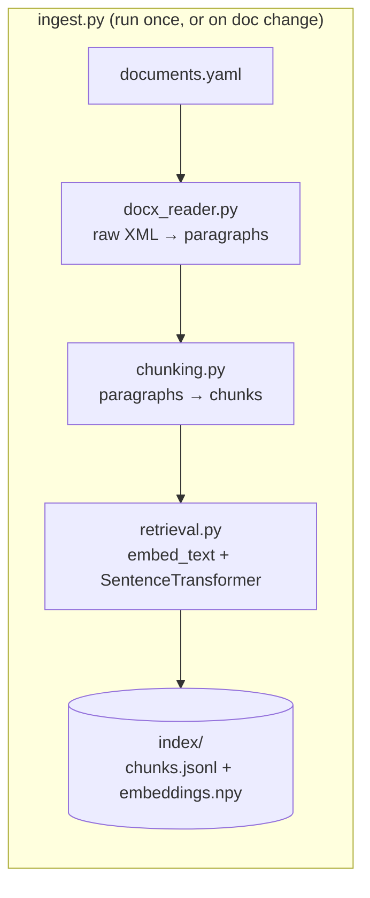
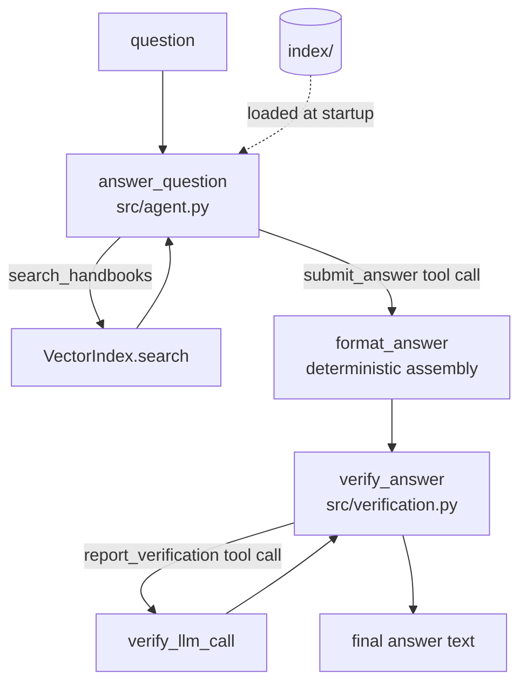

# Wisq: RAG Q&A System Design
Answers employee questions about Acme's HR benefits: every claim must be grounded in retrieved evidence, not prior knowledge, and answers stay version- and jurisdiction-aware. It's a CLI that retrieves from three handbook .docx files instead of stuffing full documents into the prompt, every claim traced back to a chunk actually returned by a search call. Three things make this corpus harder than generic RAG: two nearly-identical global handbook versions (2025 vs. 2026) that differ only in a few numbers, a regional handbook that overrides the global one for exactly one benefit type (PTO) and defers to it for everything else, and jurisdiction names in questions ("Asia") that are broader than what the regional handbook actually covers (China, Japan, Taiwan).

## Contents

- [System Goals & Invariants](#system-goals--invariants)
- [Non-goals](#non-goals)
- [Architecture](#architecture)
- [Why the major decisions were made](#why-the-major-decisions-were-made)
- [Known failure modes](#known-failure-modes)
- [What happens when it scales?](#what-happens-when-it-scales)
- [How do we know it's correct?](#how-do-we-know-its-correct)
- [Where to find more](#where-to-find-more)

## System Goals & Invariants

- **Grounding:** every factual claim must be supported by retrieved evidence.
- **Closed-world behavior:** the model cannot use external/pretrained knowledge to answer.
- **Version correctness:** a question must not mix conflicting handbook versions.
- **Jurisdiction correctness:** regional rules apply only where explicitly applicable.
- **Fail closed:** insufficient or unverifiable evidence produces a safe fallback.
- **Deterministic interface:** LLM outputs consumed by code use structured tool schemas.

These are enforced by the mechanisms in "Why the major decisions were made" below, not just
stated as intent — but the enforcement is layered defense, not a formal proof; see
"How do we know it's correct?" for what "never knowingly ungrounded" actually means here.

## Non-goals

- Not a general-purpose HR chatbot.
- Not an authoritative source outside the indexed handbooks.
- Does not answer questions requiring information absent from the corpus.
- Does not infer undocumented company policy.
- Does not currently support arbitrary document uploads at runtime.
- Does not guarantee zero hallucinations; it uses layered grounding checks and fails closed
  when evidence cannot be verified.

## Architecture

| Path | What it is |
|---|---|
| `documents.yaml` | Declarative manifest of source documents — add/deprecate a doc here, not in code |
| `ingest.py` | Builds the index from the manifest; CLI persists to `index/` |
| `main.py` | Query CLI — no args runs 8 example queries, `--ask` runs one |
| `src/docx_reader.py` | Raw-XML `.docx` paragraph extraction |
| `src/chunking.py` | Paragraph → chunk splitting |
| `src/retrieval.py` | Embedding + `VectorIndex` (build/save/load/search) |
| `src/agent.py` | The Claude tool-use loop that turns a question into a draft answer |
| `src/verification.py` | The grounding check that turns a draft into a final answer |
| `src/models.py` | Shared dataclasses (`DocMeta`, `Paragraph`, `Chunk`, `ScoredChunk`) |
| `evals/` | Live-API acceptance suites (`eval.py`: 8 take-home queries; `edge_cases.py`: 38-case production-readiness suite) |
| `tests/` | Offline, zero-API-call unit + regression tests |
| `docs/backlog/` | Fully-investigated deferred work — root cause, fix sketch, test plan already written |
| `CLAUDE.md` | Session-continuity notes for AI agents working in this repo — orientation, correctness contract, gotchas |

Setup and day-to-day commands are in `README.md` — this doc doesn't repeat them.

**Life of a query** — tracing `python main.py --ask "What is the PTO allowance for a
Taiwanese employee?"` end to end:

1. `main.py` loads the prebuilt index (`VectorIndex.load("index")`) and calls
   `answer_question()`.
2. `answer_question()` (`src/agent.py:214`) calls `index.preload_model()` — starts loading the
   local embedding model on a background thread — then sends the question to Claude with two
   tools available: `search_handbooks` and `submit_answer`, and `tool_choice={"type": "any"}`
   forcing it to call one of them every turn.
3. Claude calls `search_handbooks` with a query like `"PTO entitlement Taiwan"`. `answer_question`
   calls `index.search()`, which embeds the query, filters candidates by any `doc_type`/
   `version_year` the model supplied, and returns the top `SEARCH_K` chunks by cosine
   similarity. Retrieved chunks accumulate in `cited_chunks`; formatted excerpts go back to
   Claude as a `tool_result`.
4. Claude may call `search_handbooks` again (e.g., to separately pull the precedence rules) —
   this repeats until it's ready to answer, capped at `MAX_TOOL_ITERATIONS = 8`.
5. Claude calls `submit_answer` with three fields — `verdict`, `reason`, `citation` — instead
   of writing free text. `format_answer()` (`src/agent.py:183`) deterministically assembles
   them into `"{verdict}\n\n{reason}\n\n— ({citation})"`.
6. `answer_question` calls `verify_answer(draft, cited_chunks, verify_llm_call)`
   (`src/verification.py:60`). If `cited_chunks` is empty, this hard-fails immediately with no
   LLM call. Otherwise it asks Claude — via a second tool call,
   `report_verification` — whether every claim in the draft is backed by the cited excerpts.
7. If `SUPPORTED`, the draft is returned as-is. If not, a fallback "can't confirm this"
   message is returned instead.
8. `main.py` prints `result.text`.

Two full Claude round-trips minimum (search+answer, then verify) is a deliberate cost — see
"Why the major decisions were made," below.

## Why the major decisions were made

### Document ingestion — `src/docx_reader.py`

**Choice:** read `word/document.xml` directly via stdlib `zipfile` + `ElementTree`, not
`python-docx`.

**Why:** `python-docx`'s `Document.paragraphs` only returns top-level body paragraphs and
silently drops anything nested in a table. The real handbooks' section headers live inside
single-cell "banner" tables, which would have dropped every header in this corpus. Walking the
raw XML directly visits every paragraph regardless of nesting.

**Tradeoff:** more code and coupling to the OOXML schema, accepted because silent data loss is
the worse failure mode.

### Chunking — `src/chunking.py`

**Choice:** one non-empty paragraph = one chunk, tagged with the nearest preceding heading
(style plus a length guard, since the two document families use inconsistent heading
conventions). Specific sections can opt into sentence-level splitting instead, via
`documents.yaml` — today only APAC's `SCOPE` section uses it.

**Why:** sentence-splitting is scoped to that one confirmed-diluted section, not corpus-wide —
a corpus-wide version regressed retrieval quality elsewhere without fixing anything a
targeted opt-in didn't already fix.

**Tradeoff:** a policy split across two consecutive paragraphs under one heading can still
lose part of its meaning to a different chunk, since chunking is strictly one-paragraph-per-
chunk — a real structural limit worth re-checking if the corpus grows.

### Embedding & retrieval — `src/retrieval.py`

**Choice:** `VectorIndex` is a list of chunks plus a plain `numpy` array of normalized
embeddings — cosine similarity via `np.dot`, no vector database (`SEARCH_K = 10`).
`embed_text()` prepends a metadata header (document, jurisdiction, version year, section) to
each chunk before embedding, and `search()` also accepts explicit `doc_type`/`version_year`
filters.

**Why:** the 2025 and 2026 PTO paragraphs are nearly word-for-word identical except the day
count, so embedding similarity alone can't reliably tell them apart — the header and filters
are two independent ways to break that tie. Plain `numpy` was verified against a Chroma +
hybrid-search prototype before being kept; see `docs/backlog/2026-08-20-vector-db-migration-for-scale.md`.

**Tradeoff:** `version_year=None` on a chunk has to mean "matches any year filter," since
APAC's regional handbook is evergreen — an easy footgun if inverted. Plain `numpy` won't hold
indefinitely; a vector-DB migration is designed and ready once the corpus outgrows a linear
scan.

### Agent loop & structured tool contracts — `src/agent.py`

**Choice:** `answer_question()` drives a multi-hop Claude tool-use loop (`claude-sonnet-5`, no
`temperature` — this model rejects non-default sampling params) with two forced tools:
`search_handbooks` and `submit_answer` (three fields — `verdict`/`reason`/`citation` — called
once when ready). The verifier uses the same tool-schema pattern for its own classification.

**Why:** free chat text produced inconsistent formatting under live sampling. A tool schema
makes the shape a code guarantee instead of a prompt request — `format_answer()`
deterministically assembles the three submitted fields, and the layout is unit-testable
offline with zero API calls.

**Tradeoff:** more moving parts, and this only closes formatting/classification failures — it
doesn't make the model's underlying reasoning more correct, just more reliably shaped.
`MAX_TOOL_ITERATIONS = 8` caps the search loop; the `reason` field is instructed not to reveal
per-branch outcomes of a hedge, which is an instruction, not a schema constraint, and so
retains some residual sampling variance.

### Verification — `src/verification.py`

**Choice:** `verify_answer()` is a second, independent LLM pass — given the draft and only the
chunks actually cited, ask whether every claim is directly supported. Deterministic checks run
first with no LLM call: `grounded=False` if no excerpts were cited, or if the draft's citation
doesn't name any retrieved document. The verifier prompt also explicitly credits three
inference patterns as valid rather than "unresolved conflicts" — a specific rule carving
itself out of a general fallback, a general default with no specific override, and a closed
enumerated list with an explicit "everyone else, refer elsewhere" instruction.

**Why:** this pass is the system's actual anti-hallucination enforcement, not just the system
prompt's instructions — the prompt has leaked pretrained knowledge before, and this pass
caught and rejected it. The three credited patterns exist because the verifier initially
under-credited valid logical consequences of the excerpts as unsupported.

**Tradeoff:** a full second API round-trip per question — real latency and cost, accepted as
the price of "never knowingly return an ungrounded answer." Each credited pattern needed
adversarial testing before shipping, since crediting more inference patterns risks making the
verifier too lenient — and even so, one pattern has resurfaced live and remains open
(`docs/backlog/2026-08-22-verify-answer-carve-out-overgeneralization-false-rejection.md`).

### Cross-cutting principles

- **Guarantee structurally, not by prompt request**, whenever downstream code depends on a
  specific output shape — reach for a tool schema, not a prompt instruction and hope.
- **Fail closed, not open, on grounding** — the system would rather under-answer than
  fabricate.
- **Prefer the narrowest fix confirmed to work** over a more general one that "should" work —
  applies to the chunking decision above and to every scale-motivated decision deferred below.
- **Config over code branching** — `documents.yaml` governs which documents are active and
  which sections get sentence-split.
- **Every non-trivial prompt or logic change gets a live-verification pass before landing** —
  offline tests can't catch LLM sampling variance.

## Known failure modes

**Correctness / reliability**

- A policy split across two consecutive paragraphs under one heading can still lose its
  second half — chunking is strictly one-paragraph-per-chunk. Confirmed absent in the current
  corpus today (systematic grep found no second instance beyond the one already-fixed case),
  not proven absent forever.
- Live draft-time named-entity hallucination (inventing plausible-sounding but never-retrieved
  entity names) was found and given a restrictive system-prompt fix, but only 7 live
  reproductions back it — too small a sample to prove the fix against a rare event. See
  `docs/backlog/2026-08-20-draft-time-named-entity-hallucination.md`.
- `verify_answer` can over-generalize a sibling benefit's specific carve-out into false
  suspicion of a *different* benefit the same excerpt explicitly routes to the general rule.
  Root cause confirmed analytically and reproduced live twice, but no controlled before/after
  baseline exists yet to test a fix against. See
  `docs/backlog/2026-08-22-verify-answer-carve-out-overgeneralization-false-rejection.md`.
- `verify_answer` itself is probabilistic — it can intermittently reject a genuinely correct
  draft (a false rejection, not a fabrication) even outside the pattern above. See "How do we
  know it's correct?" for a measured rate.

**Test/eval harness gaps**

- The word markers in `evals/matching.py` (`"unknown"`, `"which country"`, etc.) are
  substring/keyword matching on free-form text, not semantic — gameable by construction.
- `Expectation.doc_type`/`version_year` checks (`evals/matching.py`) are a weaker precondition
  than they look — they check whether a matching document was retrieved anywhere in the
  conversation, not that the final answer's figure actually came from it. See
  `docs/backlog/2026-08-24-eval-matcher-cited-chunks-weak-doc-version-check.md`.

## What happens when it scales?

Ranked by what would break first if this stopped being a take-home and started being a real
service, not by how long each has been on the backlog.

1. **Observability** — nothing exists today: no logging of retrieval scores, tool-call
   sequences, `verify_answer` accept/reject rates, or latency/cost per question. The single
   biggest gap between "works when I run it live and read the output" and "operable as a
   service." Trigger: before onboarding any real user traffic.
2. **Vector DB migration** — designed and prototype-verified against the real corpus, found no
   accuracy or performance win at the current ~73-chunk size. Trigger: corpus size, not
   calendar time. `docs/backlog/2026-08-20-vector-db-migration-for-scale.md`.
3. **LLM-assisted (semantic) chunking** — two prototypes confirmed real differentiating value,
   but neither was needed to fix any gap found in this specific 3-document corpus. Trigger: a
   new document whose structure the current paragraph/heading rules can't safely assume.
   `docs/backlog/2026-08-20-llm-assisted-semantic-chunking.md`.
4. **Cost & latency at volume** — two full Claude round-trips per question is a deliberate
   grounding tradeoff, acceptable at take-home volume. Prompt caching was investigated and
   shelved (97% of per-question time is Claude generation, not input reprocessing — caching
   saves cost, not the latency that motivated the question).
5. **Service-ification and concurrency** — `main.py` is a synchronous CLI, one process per
   question. A real service needs a long-lived process serving concurrent requests against one
   loaded index, and request-level timeout/retry/backoff, which doesn't exist today — an API
   error or rate limit currently just propagates as an exception.
6. **Document lifecycle at scale** — `documents.yaml` is hand-edited today. Growing to many
   more handbooks needs validation that a new manifest entry doesn't silently conflict with an
   existing one, and a decision on whether re-ingestion should trigger from a document-upload
   flow rather than a manual CLI run.

## How do we know it's correct?

Two kinds of check, kept separate. tests/ is offline, zero API calls, real local 
embeddings: the regression guard for chunking/retrieval/matching (111 tests). 
`evals/` is live-API: `eval.py` runs the 8 take-home queries on every meaningful change; 
`edge_cases.py` is a 38-case production-readiness suite (entity resolution, negative space, grounding, consistency, precedence generalization, entity-hallucination guard), 
run on demand given its API cost. Offline tests catch logic regressions instantly; only a live run catches sampling-variance bugs, 
and live reruns have repeatedly surfaced real ones (verdict ordering, verifier false-rejections, formatting). 
A green eval run is a smoke test, not a regression gate: matches()'s word markers stay gameable by phrasing (see "Known failure modes").

Grounding is enforced by a second LLM pass, not a deterministic proof, so correctness is measured, not guaranteed. 
The numbers below are real measurements, not SLO targets: this project has no committed SLOs yet (see "Observability").

| Metric | Measured value | Method / sample |
|---|---|---|
| Retrieval correct @ K (K≤10) | **11/11 (100%)** | Offline, deterministic: known-answer, entity-resolution-variant, and precedence-rule retrieval probes (`tests/test_retrieval_recall.py`, `tests/test_retrieval_entity_resolution.py`) |
| Correct final answer | **41/46 (89%)** | Single live rep, `eval.py` (8) + `edge_cases.py` (38), 2026-08-24. Of the 5 non-matches: 1 is a confirmed false rejection (below); the other 4 are correctly-grounded, non-fabricating answers that missed the eval matcher's specific keyword phrasing — a harness precision gap, not a system error (see "Known failure modes") |
| Unsupported-question decline rate | **7/7 (100%)** | Same run: every deliberately-unanswerable question (`grounding` + `negative_space` categories) got a grounded, non-fabricating "no data" response; the matcher recognized the specific wording in 5/7 |
| False rejection rate (flagship queries) | **3/32 (9%)** | 4 live reps of the 8 take-home queries, 2026-08-24. All 3 rejections cluster on gym-benefit precedence questions, matching the still-open pattern in `docs/backlog/2026-08-22-verify-answer-carve-out-overgeneralization-false-rejection.md` |
| Latency (single question, warm process) | **p50 6.5s / p90 8.5s / p95 9.0s / max 16.0s** | Same 46-query run, wall-clock per `answer_question()` call (includes both Claude round-trips + retrieval) |
| LLM/API transport failure rate | **0 observed** | 0 hard API errors/timeouts across the 70 live calls behind this table (46 + 24 above) — too small a sample and no dedicated retry/error telemetry exists yet to call this a measured rate (see "Observability" above) |

Live-verification discipline (multiple reps, not one — see "Why the major decisions were
made") is what has caught nearly every real bug in this project's history; the full
decision-by-decision record, including every live rep count behind a fix, is in
`docs/TRANSCRIPT.md`.

## Where to find more

- **`CLAUDE.md`** — session-continuity notes for AI agents working in this repo: orientation,
  the correctness contract, operating rules, and gotchas.
- **`docs/TRANSCRIPT.md`** — the full decision-by-decision narrative, in the exact order each
  decision was made, with the live evidence gathered before each one shipped, including dead
  ends that were tried and reverted. **`docs/HISTORY.md`** is a short, section-linked index
  into it — start there.
- **`docs/backlog/`** — every deferred item referenced above, fully investigated: root cause,
  suggested fix, risk, and test plan already written.
- **`docs/superpowers/specs/2026-08-19-rag-qa-system-design.md`** — the original
  pre-implementation proposal. Superseded by this document; kept for historical context.
